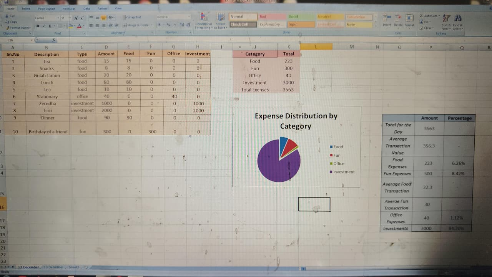

# Excel Expense Tracker

This project is a simple Expense Tracker created using Microsoft Excel.

It helps track daily expenses and categorize them into different groups.

## Features

• Expense recording with description and category  
• Category wise expense calculation  
• Summary table for quick insights  
• Expense distribution pie chart  

## Categories Used

- Food
- Fun
- Office
- Investment

## Tools Used

Microsoft Excel

## Skills Demonstrated

- Excel formulas
- Data organization
- Basic data analysis
- Chart visualization

## Project Screenshot

